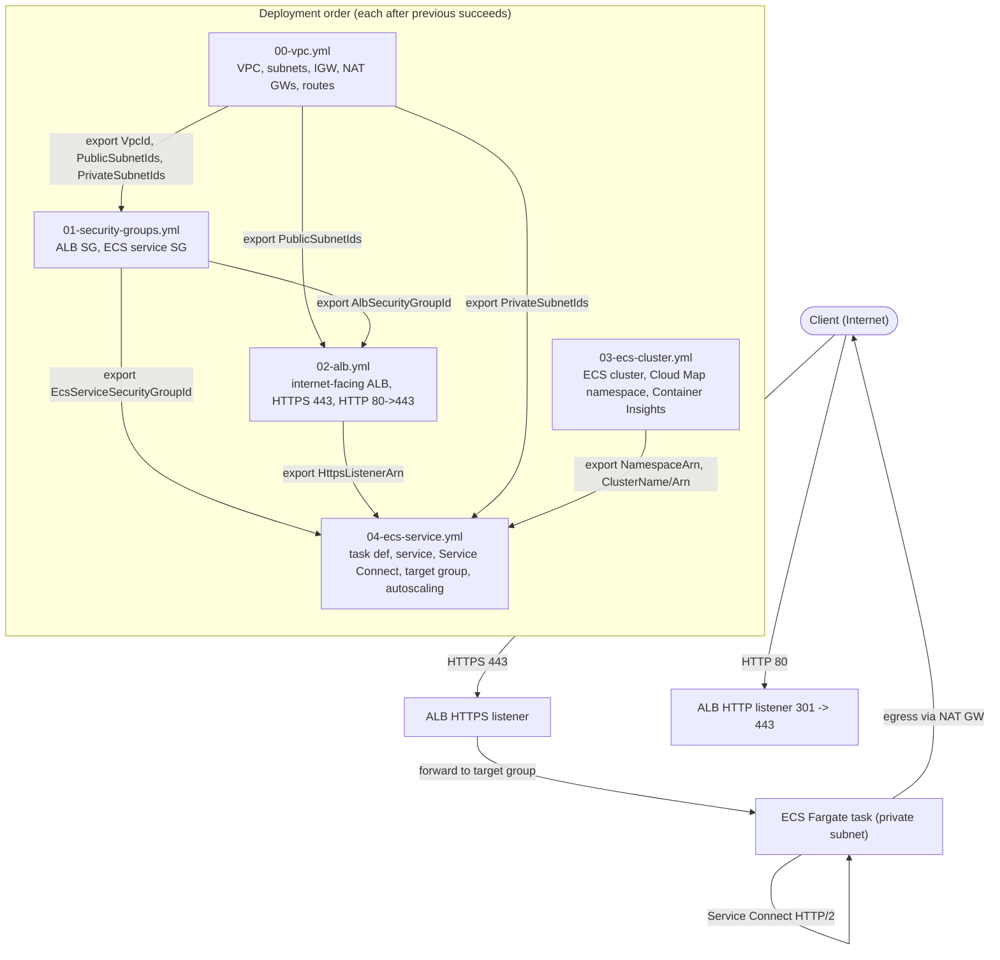
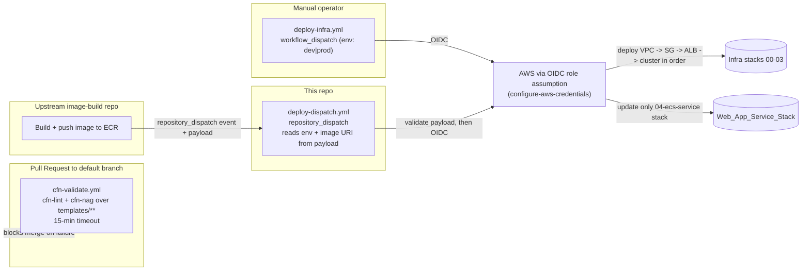

# Design Document

## Overview

This design describes a modular, layered set of AWS CloudFormation templates (YAML) that provision production-grade infrastructure for containerized workloads on ECS Fargate, together with the GitHub Actions CI/CD pipelines that validate and deploy them. Infrastructure is decomposed into five independently deployable layers, each a single CloudFormation stack, deployed in strict dependency order. Layers communicate exclusively through CloudFormation cross-stack references (`Export` / `Fn::ImportValue`) so that each layer can be updated in place without duplicating configuration. Per-environment parameter files drive `dev` and `prod` from the same templates.

The layering, one-stack-per-layer decomposition, and cross-stack reference model directly satisfy Requirement 6 (Cross-Stack References) and the structural intent of Requirements 1-5. The two CI/CD pipelines satisfy Requirements 8-10, and the parameter-file strategy satisfies Requirement 7.

Design goals:

- **Independent layers**: each layer is a standalone stack with an explicit input/output contract, so a change to one layer (for example, a new web-app image) never redeploys unrelated layers.
- **Least privilege by default**: exactly two security groups, tasks in private subnets, TLS terminated at the ALB, and OIDC-based short-lived AWS credentials in CI/CD.
- **Fail fast and safe**: invalid inputs are rejected at template validation time; failed stack operations roll back and leave prior state intact; in-use exports cannot be deleted.
- **Environment isolation**: every export name is prefixed with the environment identifier so `dev` and `prod` exports never collide.

### Requirements Coverage Map

| Requirement | Covered by |
| --- | --- |
| 1. VPC networking | `templates/00-vpc.yml` (Components: VPC_Template) |
| 2. Security groups | `templates/01-security-groups.yml` (Components: Security_Group_Template) |
| 3. ALB with TLS | `templates/02-alb.yml` (Components: ALB_Template) |
| 4. ECS cluster + Service Connect | `templates/03-ecs-cluster.yml` (Components: Cluster_Template) |
| 5. Reusable ECS service | `templates/04-ecs-service.yml` (Components: Service_Template) |
| 6. Cross-stack references | Cross-Stack Reference Naming Convention section |
| 7. Per-environment parameter files | Parameter File Strategy section |
| 8. CI validation | `.github/workflows/cfn-validate.yml` (CI/CD section) |
| 9. Manual deployment | `.github/workflows/deploy-infra.yml` (CI/CD section) |
| 10. Dispatch deployment | `.github/workflows/deploy-dispatch.yml` (CI/CD section) |

## Architecture

The system is five CloudFormation stacks deployed in a linear dependency chain, plus three GitHub Actions workflows. The stacks pass values forward through exports; each downstream stack imports what it needs from the stacks before it.

### Layered Stack and Traffic Flow



### CI/CD Pipelines and Dispatch Flow



Key architectural decisions and rationale:

- **One stack per layer (not a single nested stack)** — Requirement 6.1 requires values to flow through cross-stack references rather than duplicated parameters, and Requirement 10.2 requires updating only the service stack without touching the others. Independent stacks make selective updates trivial and keep blast radius small.
- **Linear dependency chain** — the deploy order VPC -> SG -> ALB -> cluster -> service mirrors the import graph. Requirement 9.1 fixes the order for the manual workflow; the service stack is deployed separately (manually or by dispatch).
- **Cross-stack references over SSM/parameters** — `Export`/`ImportValue` gives CloudFormation built-in protection: an export that is actively imported cannot be deleted or modified (Requirement 6.4), and an unresolved import fails the operation before any resource change (Requirement 6.3).

## Components and Interfaces

Each subsection documents one template: its purpose, key parameters, key resources, and its cross-stack exports/imports.

### VPC_Template — `templates/00-vpc.yml`

**Purpose**: Provision the multi-AZ VPC and all networking primitives. (Requirement 1)

**Key parameters**:
- `Environment` (String, `AllowedValues: [dev, prod]`) — prefixes all export names.
- `VpcCidr` (String) — IPv4 CIDR, constrained with an `AllowedPattern` regex that accepts only valid IPv4 CIDRs with prefix length /16-/28. (Requirement 1.1, 1.2)
- `AvailabilityZoneCount` (Number, `AllowedValues: [2, 3]`, default 2) — number of AZs to span (>= 2). Subnet CIDRs are derived per AZ using `Fn::Cidr` to guarantee non-overlapping blocks.

**Key resources**:
- `AWS::EC2::VPC` with the parameterized CIDR.
- `AWS::EC2::InternetGateway` + `AWS::EC2::VPCGatewayAttachment` (Requirement 1.4).
- One public and one private `AWS::EC2::Subnet` per AZ, CIDRs computed via `Fn::Cidr`/`Fn::Select` over `Fn::GetAZs` (Requirement 1.3).
- One `AWS::EC2::NatGateway` per AZ (each with an `AWS::EC2::EIP`), placed in the same-AZ public subnet (Requirement 1.5).
- Public route table with `0.0.0.0/0 -> IGW` (Requirement 1.6); one private route table per AZ with `0.0.0.0/0 -> same-AZ NAT` (Requirement 1.7).

**Exports** (each `Fn::Sub "${Environment}-<logical>"`):
- `${Environment}-VpcId`
- `${Environment}-PublicSubnetIds` (comma-delimited list via `Fn::Join`)
- `${Environment}-PrivateSubnetIds` (comma-delimited list)
- Also individual `${Environment}-PublicSubnet{N}Id` / `${Environment}-PrivateSubnet{N}Id` for consumers that need discrete subnet references.

**Imports**: none.

### Security_Group_Template — `templates/01-security-groups.yml`

**Purpose**: Provision exactly two security groups implementing least-privilege access. (Requirement 2). No RDS or database security group is created.

**Key parameters**:
- `Environment` (String, `AllowedValues: [dev, prod]`).
- `AlbIngressCidr` (String) — source CIDR permitted to reach the ALB on 443, constrained by an `AllowedPattern` CIDR regex (Requirement 2.2, 2.6).
- `ContainerListenerPort` (Number, `MinValue: 1`, `MaxValue: 65535`) — the ECS container port the ALB SG is allowed to reach on the ECS service SG (Requirement 2.3).

**Key resources**:
- `AWS::EC2::SecurityGroup` **AlbSecurityGroup**: ingress TCP 443 from `AlbIngressCidr` only (Requirement 2.2).
- `AWS::EC2::SecurityGroup` **EcsServiceSecurityGroup**: no inline ingress; a separate `AWS::EC2::SecurityGroupIngress` allows TCP on `ContainerListenerPort` with `SourceSecurityGroupId = AlbSecurityGroup`. All other inbound is denied by the default-deny nature of security groups (Requirement 2.3).

**Exports**:
- `${Environment}-AlbSecurityGroupId`
- `${Environment}-EcsServiceSecurityGroupId`

**Imports**:
- `${Environment}-VpcId` from VPC_Template (Requirement 2.4). An unresolved import fails the operation before any change (Requirement 2.7, 6.3).

### ALB_Template — `templates/02-alb.yml`

**Purpose**: Provision the internet-facing ALB with TLS termination and an HTTP-to-HTTPS redirect. (Requirement 3)

**Key parameters**:
- `Environment` (String, `AllowedValues: [dev, prod]`).
- `CertificateArn` (String) — ACM certificate ARN, constrained by an `AllowedPattern` that matches `arn:aws:acm:...:certificate/...` and rejects empty values (Requirement 3.4).

**Key resources**:
- `AWS::ElasticLoadBalancingV2::LoadBalancer` `Scheme: internet-facing`, `Subnets` = imported public subnet list, spanning >= 2 AZs (Requirement 3.1); `SecurityGroups` = imported ALB SG (Requirement 3.2).
- `AWS::ElasticLoadBalancingV2::Listener` on 443, `Protocol: HTTPS`, `Certificates: [{ CertificateArn }]`, default action fixed-response 503 (target groups attach later from the service stack) (Requirement 3.3).
- `AWS::ElasticLoadBalancingV2::Listener` on 80, `Protocol: HTTP`, default action `Type: redirect` with `Port: 443`, `Protocol: HTTPS`, `StatusCode: HTTP_301`, host/path/query preserved via `#{host}` / `#{path}` / `#{query}` defaults (Requirement 3.5).

**Exports**:
- `${Environment}-AlbArn`
- `${Environment}-AlbDnsName`
- `${Environment}-HttpsListenerArn`

**Imports**:
- `${Environment}-PublicSubnetIds` from VPC_Template.
- `${Environment}-AlbSecurityGroupId` from Security_Group_Template.

### Cluster_Template — `templates/03-ecs-cluster.yml`

**Purpose**: Provision one ECS Fargate cluster with a Cloud Map namespace for Service Connect. (Requirement 4)

**Key parameters**:
- `Environment` (String, `AllowedValues: [dev, prod]`).
- `NamespaceName` (String) — the Cloud Map HTTP namespace name used by Service Connect.

**Key resources**:
- `AWS::ECS::Cluster` with `ClusterSettings: [{ Name: containerInsights, Value: enabled }]` (Requirement 4.3) and `ServiceConnectDefaults.Namespace` set to the namespace.
- `AWS::ECS::ClusterCapacityProviderAssociations` with `CapacityProviders: [FARGATE, FARGATE_SPOT]` (Requirement 4.1).
- `AWS::ServiceDiscovery::HttpNamespace` — the HTTP-type namespace required by Service Connect (Requirement 4.2).

**Exports**:
- `${Environment}-ClusterName` (Requirement 4.5)
- `${Environment}-ClusterArn` (Requirement 4.6)
- `${Environment}-NamespaceArn` (Requirement 4.7)

**Imports**: none. (Rollback on any resource failure is CloudFormation default behavior, satisfying Requirement 4.4.)

### Service_Template — `templates/04-ecs-service.yml` (Web_App_Service_Stack)

**Purpose**: Reusable Fargate service template deploying a containerized web application (a starter Next.js app) whose image is pulled from ECR. (Requirement 5)

**Key parameters**:
- `Environment` (String, `AllowedValues: [dev, prod]`).
- `ServiceName` (String).
- `ContainerImageUri` (String) — ECR image URI (Requirement 5.2, supplied by dispatch payload for image updates).
- `ContainerPort` (Number, `MinValue: 1`, `MaxValue: 65535`) (Requirement 5.2, 5.8).
- `TaskCpu` (String, `AllowedValues` = valid Fargate CPU values) and `TaskMemory` (String, `AllowedValues` = valid memory values). The valid combination is enforced by a `Rules` section (see Data Models) (Requirement 5.1, 5.8).
- `ServiceConnectPort` (Number) — port for Service Connect (Requirement 5.4).
- `DesiredCount` (Number, `MinValue: 0`) (Requirement 5.2).
- `MinTaskCount` / `MaxTaskCount` (Number) — autoscaling bounds; `MinTaskCount <= MaxTaskCount` enforced by a `Rules` assertion (Requirement 5.9).
- `TargetCpuUtilization` (Number, `MinValue: 1`, `MaxValue: 100`) (Requirement 5.7, 5.8).

**Key resources**:
- `AWS::ECS::TaskDefinition` `RequiresCompatibilities: [FARGATE]`, `NetworkMode: awsvpc`, `Cpu`/`Memory` from params, container with `Image: ContainerImageUri`, `PortMappings` including a named mapping with `AppProtocol: http2` on `ServiceConnectPort` (Requirement 5.1, 5.2, 5.4).
- `AWS::ECS::Service`:
  - `LaunchType: FARGATE`, `NetworkConfiguration.AwsvpcConfiguration.Subnets` = imported private subnets, `SecurityGroups` = imported ECS service SG (Requirement 5.6), `AssignPublicIp: DISABLED`.
  - `ServiceConnectConfiguration` `Enabled: true`, `Namespace` = imported namespace ARN, service `PortName` mapped with `AppProtocol: http2` (Requirement 5.3, 5.4).
  - `LoadBalancers` referencing a `AWS::ElasticLoadBalancingV2::TargetGroup`, plus a `AWS::ElasticLoadBalancingV2::ListenerRule` on the imported HTTPS listener (Requirement 5.5).
- `AWS::ElasticLoadBalancingV2::TargetGroup` `TargetType: ip`, `Protocol: HTTP`, `Port: ContainerPort`, health check path configurable.
- `AWS::ApplicationAutoScaling::ScalableTarget` (`MinCapacity: MinTaskCount`, `MaxCapacity: MaxTaskCount`) and `AWS::ApplicationAutoScaling::ScalingPolicy` `TargetTrackingScaling` on `ECSServiceAverageCPUUtilization` = `TargetCpuUtilization` (Requirement 5.7).

**Exports**:
- `${Environment}-${ServiceName}-ServiceArn` (optional, for observability tooling).

**Imports**:
- `${Environment}-PrivateSubnetIds` from VPC_Template.
- `${Environment}-EcsServiceSecurityGroupId` from Security_Group_Template.
- `${Environment}-HttpsListenerArn` from ALB_Template.
- `${Environment}-ClusterName` and `${Environment}-NamespaceArn` from Cluster_Template.

## Cross-Stack Reference Naming Convention

(Requirement 6)

- **Mechanism**: every produced value is a stack `Output` with an `Export.Name`; every consumer uses `Fn::ImportValue`. Values are never duplicated as parameters between stacks (Requirement 6.1).
- **Naming pattern**: `Export.Name: !Sub "${Environment}-<LogicalName>"`. The `Environment` parameter (`dev` or `prod`) followed by a hyphen guarantees that `dev` and `prod` exports never collide, so both environments can coexist in the same account/region (Requirement 6.2).
- **Uniqueness within an environment**: CloudFormation itself enforces that export names are unique within an account/region. If two templates in the same environment declare the same export name, the second stack operation fails with a duplicate-export error (Requirement 6.5).
- **In-use protection**: CloudFormation refuses to delete or modify an export that another stack imports, surfacing an "export in use" error (Requirement 6.4).
- **Unresolved-import safety**: if an imported export does not exist at deploy time, CloudFormation fails the operation before creating or modifying any resource, leaving prior state intact and naming the missing export (Requirement 6.3).

Canonical export inventory (per environment):

| Producer | Export logical name | Consumers |
| --- | --- | --- |
| 00-vpc | `VpcId` | 01-security-groups |
| 00-vpc | `PublicSubnetIds` | 02-alb |
| 00-vpc | `PrivateSubnetIds` | 04-ecs-service |
| 01-security-groups | `AlbSecurityGroupId` | 02-alb |
| 01-security-groups | `EcsServiceSecurityGroupId` | 04-ecs-service |
| 02-alb | `AlbArn`, `AlbDnsName`, `HttpsListenerArn` | 04-ecs-service (listener) |
| 03-ecs-cluster | `ClusterName`, `ClusterArn`, `NamespaceArn` | 04-ecs-service |

## Parameter File Strategy

(Requirement 7)

- **Layout**: one file per template per environment.
  - `parameters/dev/00-vpc.json`, `parameters/dev/01-security-groups.json`, `parameters/dev/02-alb.json`, `parameters/dev/03-ecs-cluster.json`, `parameters/dev/04-ecs-service.json`
  - Identical set under `parameters/prod/`.
- **Format**: the `aws cloudformation deploy` **`--parameter-overrides`** approach, using a JSON file consumed via a small read step in the workflow. Each file is a flat JSON object of `Key: Value` pairs that the workflow converts into `Key=Value` overrides. This one format is used consistently across all templates and both environments (Requirement 7.3).

  Example `parameters/dev/00-vpc.json`:
  ```json
  {
    "Environment": "dev",
    "VpcCidr": "10.0.0.0/16",
    "AvailabilityZoneCount": "2"
  }
  ```
- **Selection**: the Deploy_Workflow resolves the file path as `parameters/${ENVIRONMENT}/<template-basename>.json` for the template being deployed (Requirement 7.4).
- **Missing file handling**: before deploying a template, the workflow checks that the resolved parameter file exists; if not, it halts without applying changes and fails with a message naming the missing file (Requirement 7.5).
- **Parameter-name integrity**: every key in a parameter file must correspond to a declared `Parameters` entry in the matching template (enforced by validation and covered by a correctness property).

## CI/CD Workflow Design

### `.github/workflows/cfn-validate.yml` (CI_Workflow — Requirement 8)

- **Trigger**: `pull_request` targeting the default branch (`branches: [main]`), types `opened`, `synchronize`, `reopened`.
- **Timeout**: `timeout-minutes: 15` on the job; exceeding it terminates with a failing status (Requirement 8.6).
- **Steps**:
  1. Checkout.
  2. Discover template files under `templates/**` (recursive). Zero templates is a successful no-op (Requirement 8.1, 8.2).
  3. Run `cfn-lint` over every discovered template; any error-severity finding fails the job and prints file path + location (Requirement 8.1, 8.3).
  4. Run `cfn-nag` (`cfn_nag_scan --input-path templates/`) over every template; any failing finding fails the job and prints file path + rule id (Requirement 8.2, 8.4).
  5. If both tools report no error/failing findings, the job passes (Requirement 8.5).
- **No AWS credentials** are needed; CI only lints and scans.

### `.github/workflows/deploy-infra.yml` (Deploy_Workflow — Requirement 9)

- **Trigger**: `workflow_dispatch` with input `environment` (`type: choice`, `options: [dev, prod]`). The choice constraint enforces exactly `dev` or `prod`; anything else cannot be selected and an invalid value is rejected (Requirement 9.2, 9.3).
- **Permissions**: `id-token: write`, `contents: read` for OIDC.
- **Auth**: `aws-actions/configure-aws-credentials` assuming a per-environment IAM role via OIDC (no long-lived keys). Authentication completes before any deployment; failure fails the job and deploys nothing (Requirement 9.4, 9.5).
- **Deploy sequence** (each step gated on the previous succeeding, stopping on first failure — Requirement 9.1, 9.6):
  1. Verify parameter file exists, then `aws cloudformation deploy` `00-vpc.yml`.
  2. `01-security-groups.yml`.
  3. `02-alb.yml`.
  4. `03-ecs-cluster.yml`.
  - GitHub Actions' default fail-fast per-step behavior halts subsequent steps on failure; the failing step names the template that failed. The service stack is intentionally excluded from the manual infra workflow (it is deployed via dispatch or a separate manual run).

### `.github/workflows/deploy-dispatch.yml` (Dispatch_Workflow — Requirement 10)

- **Trigger**: `repository_dispatch` with a configured `types: [web-app-image-pushed]`. Fired by the upstream image-build repo after it pushes the image to ECR.
- **Payload**: `client_payload` carries `environment` and `image_uri` (Requirement 10.3).
- **Validation-first job**:
  1. Assert `environment` is exactly `dev` or `prod`; otherwise fail (Requirement 10.5).
  2. Assert `image_uri` (and `environment`) are present and non-empty; a missing required value fails the job (Requirement 10.6).
- **Auth**: OIDC role assumption before any update; failure fails the job (Requirement 10.4, 10.7).
- **Update step**: `aws cloudformation deploy` targeting **only** the `04-ecs-service.yml` stack for the payload environment, overriding `ContainerImageUri` with the payload image URI and merging the rest from `parameters/${env}/04-ecs-service.json`. No other stack is referenced, so VPC/SG/ALB/cluster remain unchanged (Requirement 10.1, 10.2).

## Data Models

### Stack Input/Output Contracts

Each stack's contract is its `Parameters` (inputs) and `Outputs`/`Exports` (outputs). Cross-stack edges are the imports listed per stack above.

### Valid Fargate CPU/Memory Combinations

Enforced in `04-ecs-service.yml` via `AllowedValues` on each parameter plus a `Rules` section asserting the pairing. The valid set (per [AWS ECS task CPU/memory documentation](https://docs.aws.amazon.com/AmazonECS/latest/developerguide/task-cpu-memory-error.html); content was rephrased for compliance with licensing restrictions):

| CPU (units) | Allowed memory (MiB) |
| --- | --- |
| 256 | 512, 1024, 2048 |
| 512 | 1024 through 4096 (1 GB increments) |
| 1024 | 2048 through 8192 (1 GB increments) |
| 2048 | 4096 through 16384 (1 GB increments) |
| 4096 | 8192 through 30720 (1 GB increments) |

`Rules` example (conceptual):
```yaml
Rules:
  Cpu256Memory:
    RuleCondition: !Equals [!Ref TaskCpu, "256"]
    Assertions:
      - Assert: !Contains [["512","1024","2048"], !Ref TaskMemory]
        AssertDescription: "For 256 CPU, memory must be 512, 1024, or 2048 MiB"
  MinLeqMax:
    Assertions:
      - Assert: !Not [!Equals [!Ref MinTaskCount, ""]]
      # MinTaskCount <= MaxTaskCount enforced via numeric assertion
```

### Contract Summary Table

| Stack | Key inputs (parameters) | Outputs (exports, env-prefixed) |
| --- | --- | --- |
| 00-vpc | Environment, VpcCidr (/16-/28), AvailabilityZoneCount | VpcId, PublicSubnetIds, PrivateSubnetIds, per-AZ subnet ids |
| 01-security-groups | Environment, AlbIngressCidr, ContainerListenerPort | AlbSecurityGroupId, EcsServiceSecurityGroupId |
| 02-alb | Environment, CertificateArn | AlbArn, AlbDnsName, HttpsListenerArn |
| 03-ecs-cluster | Environment, NamespaceName | ClusterName, ClusterArn, NamespaceArn |
| 04-ecs-service | Environment, ServiceName, ContainerImageUri, ContainerPort, TaskCpu, TaskMemory, ServiceConnectPort, DesiredCount, Min/MaxTaskCount, TargetCpuUtilization | (optional) ServiceArn |

## Error Handling

The design maps each IF-THEN acceptance criterion to a concrete failure mechanism. Two mechanisms dominate: **template-time validation** (parameter constraints, `Rules`, `AllowedPattern`) which rejects bad inputs before resources are created, and **CloudFormation service behavior** (rollback, import resolution, export-in-use protection) which protects deploy-time integrity.

| Error condition | Requirement | Handling mechanism |
| --- | --- | --- |
| Invalid VPC CIDR (not IPv4 /16-/28) | 1.2 | `AllowedPattern` regex on `VpcCidr`; template validation fails, no resources created |
| Invalid ALB source CIDR | 2.6 | `AllowedPattern` CIDR regex on `AlbIngressCidr`; validation error |
| Unresolvable VPC id import | 2.7, 6.3 | `Fn::ImportValue` fails the operation pre-change; missing export named |
| Empty/invalid ACM cert ARN | 3.4 | `AllowedPattern` ACM ARN regex on `CertificateArn`; validation error |
| Cluster resource provisioning failure | 4.4 | CloudFormation default rollback to prior state; failure event identifies resource |
| Invalid container port / CPU / memory / target CPU | 5.8 | `MinValue`/`MaxValue` + `AllowedValues` + `Rules` combination assertion; validation error naming the parameter |
| MinTaskCount > MaxTaskCount | 5.9 | `Rules` numeric assertion with `AssertDescription` indicating invalid scaling bounds |
| Missing cross-stack import | 6.3 | Operation halts before any resource change; prior state retained; missing export surfaced |
| Deleting/modifying an in-use export | 6.4 | CloudFormation "export in use" error rejects the operation |
| Duplicate export name in environment | 6.5 | CloudFormation duplicate-export error fails the deployment |
| Missing parameter file for environment | 7.5 | Workflow pre-check halts deploy, fails naming the missing file |
| Invalid environment input (deploy) | 9.3 | `workflow_dispatch` `choice` restricts to dev/prod; invalid rejected, nothing deployed |
| AWS auth failure (deploy) | 9.5 | configure-aws-credentials step fails; job stops before any deploy |
| Any template deploy failure (deploy) | 9.6 | Step failure halts subsequent steps; failing step names the template |
| Invalid environment in dispatch payload | 10.5 | Validation job asserts dev/prod; fails otherwise |
| Missing required dispatch payload value | 10.6 | Validation job asserts presence; fails otherwise |
| AWS auth failure (dispatch) | 10.7 | configure-aws-credentials step fails; job stops before update |
| CI timeout exceeded | 8.6 | `timeout-minutes: 15` terminates job with failing status |


## Correctness Properties

*A property is a characteristic or behavior that should hold true across all valid executions of a system — essentially, a formal statement about what the system should do. Properties serve as the bridge between human-readable specifications and machine-verifiable correctness guarantees.*

The declarative resource-provisioning criteria (create a VPC, enable Container Insights, add a listener) are validated by cfn-lint, cfn-nag, and snapshot/synth assertions rather than property-based testing, because their behavior does not vary with input. The properties below capture the parts of this feature that DO have a meaningful "for all" statement: pure, checkable invariants over the repository artifacts (parsed templates, parameter files, and workflow definitions) and over the parameter-validation logic. A shared test harness parses the five templates, the parameter files under `parameters/dev` and `parameters/prod`, and the three workflow YAML files into in-memory models that these properties quantify over.

### Property 1: Subnet CIDR layout is non-overlapping and complete per AZ

*For any* valid VPC CIDR (prefix /16-/28) and *any* Availability Zone count in the supported range (2-3), the derived subnet layout contains exactly one public and exactly one private subnet per AZ, and all derived subnet CIDR blocks are pairwise non-overlapping and contained within the VPC CIDR.

**Validates: Requirements 1.3**

### Property 2: Every import resolves to a produced export (no duplicated parameters)

*For any* template in the artifact set and *any* value it consumes that is produced by another template, the value is consumed through an `Fn::ImportValue` whose imported name matches an `Export.Name` declared by some other template in the set — never through a duplicated parameter carrying the producer's value.

**Validates: Requirements 2.4, 5.3, 5.5, 5.6, 6.1, 6.3**

### Property 3: Every export name is environment-prefixed

*For any* export declared by *any* template, and *any* environment in {dev, prod}, the resolved export name begins with the environment identifier followed by a hyphen, so that the dev-resolved and prod-resolved names for the same logical export are always distinct.

**Validates: Requirements 1.8, 2.5, 3.6, 4.5, 4.6, 4.7, 6.2**

### Property 4: Export names are unique within an environment

*For any* environment in {dev, prod}, the resolved export names across all templates deployed in that environment are pairwise unique (no two exports share a name).

**Validates: Requirements 6.5**

### Property 5: Fargate CPU/memory combinations are accepted exactly when valid

*For any* (CPU, memory) pair, the Service_Template's validation logic accepts the pair if and only if it appears in the official set of valid Fargate CPU/memory combinations.

**Validates: Requirements 5.1, 5.8**

### Property 6: Autoscaling accepts bounds exactly when min does not exceed max

*For any* (minimum task count, maximum task count) pair, the Service_Template's validation logic accepts the pair if and only if the minimum is less than or equal to the maximum.

**Validates: Requirements 5.9**

### Property 7: Every deployed template has matching parameter files in each environment

*For any* environment in {dev, prod}, there is exactly one parameter file under `parameters/{environment}/` for each template deployed by the Deploy_Workflow, and no parameter file exists without a corresponding template (a bijection between deployed templates and that environment's parameter files).

**Validates: Requirements 7.1, 7.2**

### Property 8: Parameter-file keys correspond to declared template parameters

*For any* parameter file and *any* key it contains, that key names a parameter declared in the `Parameters` section of the template the file targets.

**Validates: Requirements 7.3**

### Property 9: Deploy order is a valid topological order of the dependency graph

*For any* import edge (consumer template imports an export produced by a producer template), the Deploy_Workflow's deployment sequence places the producer template strictly before the consumer template.

**Validates: Requirements 9.1**

### Property 10: The dispatch workflow targets only the service stack

*For any* CloudFormation deploy/update action declared in the Dispatch_Workflow, the template it acts on is the Service_Template (`04-ecs-service.yml`), and none of the VPC, security-group, ALB, or cluster templates is referenced by any deploy action in that workflow.

**Validates: Requirements 10.1, 10.2**

### Property 11: Dispatch payload validation accepts exactly complete, valid payloads

*For any* dispatch `client_payload`, the Dispatch_Workflow's validation accepts the payload if and only if it contains a non-empty `environment` value that is one of {dev, prod} and a non-empty `image_uri`; payloads missing a required value or carrying an out-of-range environment are rejected.

**Validates: Requirements 10.5, 10.6**

## Testing Strategy

Testing combines three complementary layers, chosen per the nature of each requirement.

### 1. Template linting and security scanning (CI)

- **cfn-lint** over every file under `templates/**` — validates structure, resource properties, and parameter constraints (including the `AllowedPattern` regexes for CIDR and ACM ARN and the `MinValue`/`MaxValue` bounds). This is the primary safety net for the declarative provisioning criteria (Requirements 1, 2.1-2.3, 3.1-3.5, 4.1-4.3, 5.2-5.6).
- **cfn-nag** over the same set — security-scans for insecure patterns (open ingress, missing encryption). Enforces the least-privilege intent behind the two-security-group design.
- Both run in `cfn-validate.yml` on pull requests and gate merge (Requirement 8).

### 2. Example, edge-case, and snapshot tests

- **Snapshot/synth assertions** on rendered templates for the structural presence criteria: IGW attachment (1.4), NAT placement (1.5), route tables (1.6, 1.7), exactly two SGs and their ingress rules (2.1-2.3), ALB scheme and listeners including the 301 redirect preserving host/path/query (3.1-3.5), capacity providers and Container Insights and HTTP namespace (4.1-4.3), Service Connect `http2` mapping and target-group/listener wiring (5.4, 5.5).
- **Edge-case validation tests** feeding malformed and boundary inputs to the parameter constraints: invalid/boundary CIDRs (1.2, 2.6), empty/invalid ACM ARNs (3.4), out-of-range container ports (5.2) and target CPU utilization (5.7). These reuse the same generators that feed Properties 5 and 6.
- **Workflow example tests** asserting configuration and control flow: environment `choice` constrained to dev/prod (9.2, 9.3), sequential non-`continue-on-error` deploy steps that stop on first failure and name the failing template (9.6), auth step ordering before deploy/update (9.4, 10.4), `timeout-minutes: 15` (8.6), missing-parameter-file failure naming the file (7.5), and the dispatch payload reads (10.3).

### 3. Property-based tests

Properties 1-11 are implemented as property-based tests over the parsed artifact model.

- **Library**: because the assertions are over YAML/JSON artifacts and workflow definitions, the harness is written in the repository's tooling language. If the test tooling is Python, use **[Hypothesis](https://hypothesis.readthedocs.io/)**; if Node/TypeScript, use **[fast-check](https://github.com/dubzzz/fast-check)**. Do not implement property generation from scratch; use the chosen library's generators (`strategies`/`arbitraries`).
- **Iterations**: each property test runs a minimum of **100 iterations**.
- **Generators**:
  - Valid VPC CIDRs and AZ counts (Property 1).
  - (CPU, memory) pairs drawn from both the valid combination table and invalid pairings (Property 5).
  - (min, max) integer task-count pairs (Property 6).
  - Synthetic `client_payload` objects with each required key present/absent and environment values inside and outside {dev, prod} (Property 11).
  - Properties 2, 3, 4, 7, 8, 9, 10 quantify over the actual parsed artifact set; where useful, generators perturb the model (e.g., inject a mismatched key) to confirm the property detects violations, then assert it holds on the real artifacts.
- **Tagging**: each property test is tagged with a comment referencing its design property, in the format:
  `Feature: aws-ecs-cloudformation-infra, Property {number}: {property text}`
  Example: `Feature: aws-ecs-cloudformation-infra, Property 3: Every export name is environment-prefixed`.
- Each correctness property is implemented by a **single** property-based test.

### 4. Integration tests (out of PBT scope)

Behaviors owned by AWS/CloudFormation rather than our artifacts are covered by targeted integration tests with 1-2 examples, not property tests: unresolved-import failure (2.7, 6.3 runtime), cluster rollback on resource failure (4.4), in-use export protection (6.4), and OIDC authentication success/failure (9.4, 9.5, 10.4, 10.7). These verify wiring against a real or mocked environment and are not run at PBT iteration counts.

## Security Considerations

- **Least-privilege security groups**: exactly two security groups. The ALB SG admits only inbound TCP 443 from a configurable source CIDR (Requirement 2.2). The ECS service SG admits inbound only from the ALB SG on the container listener port and denies all other inbound by default (Requirement 2.3). No database/RDS security group is created, keeping the attack surface minimal.
- **Private subnets for tasks**: ECS Fargate tasks run in private subnets with `AssignPublicIp: DISABLED`; outbound access is via per-AZ NAT Gateways (Requirements 1.5, 1.7, 5.6). Tasks are never directly reachable from the internet; all ingress flows through the ALB.
- **TLS termination at the ALB**: the HTTPS listener terminates TLS using an ACM certificate (Requirement 3.3), and the HTTP listener performs a permanent 301 redirect to HTTPS (Requirement 3.5), so plaintext requests are never served.
- **OIDC instead of long-lived keys**: both deployment workflows authenticate to AWS via `aws-actions/configure-aws-credentials` assuming a per-environment IAM role through GitHub OIDC (`id-token: write`). No long-lived AWS access keys are stored as repository secrets (Requirements 9.4, 10.4). The assumed roles should be scoped to the specific stacks and resources each workflow manages.
- **Blast-radius containment for dispatch**: the dispatch workflow updates only the service stack (Property 10, Requirement 10.2) and validates the untrusted `client_payload` before authenticating or deploying (Requirement 10.5, 10.6). The `image_uri` is validated as present and, being an ECR reference, should be constrained to the account's ECR registry.
- **cfn-nag scanning in CI**: every template is security-scanned on pull requests; failing findings block merge (Requirement 8.2, 8.4), catching insecure patterns before they reach any environment.
- **Environment isolation**: environment-prefixed export names (Property 3) prevent a dev stack from accidentally importing prod values or vice versa, reducing the chance of cross-environment coupling.
